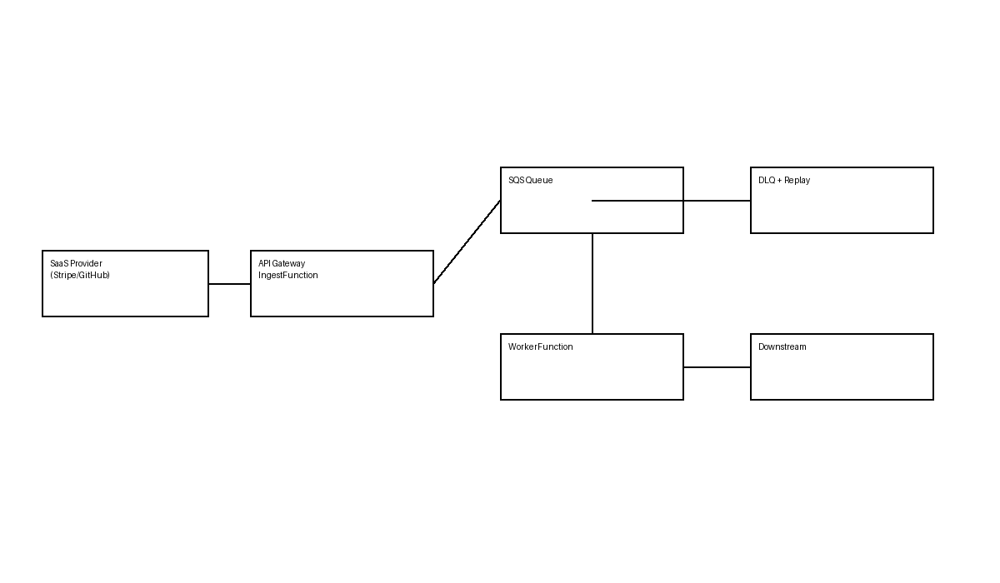

# 🛡️ Webhook Shield

## Gateway anti-caos para integraciones vía Webhooks (Serverless)

**Webhook Shield** es una **POC serverless** diseñada para actuar como un **gateway de protección, normalización y resiliencia para webhooks SaaS** (Stripe, GitHub, etc.).

Su objetivo es **proteger sistemas internos** frente a:
- eventos duplicados
- picos de tráfico
- reintentos agresivos
- caídas de sistemas downstream

mediante una arquitectura **event-driven, desacoplada y tolerante a fallos**, ejecutable tanto en **AWS real** como en **LocalStack**.

---

## 🚀 Características principales

- API Gateway serverless para recepción de webhooks
- Validación de firma HMAC por proveedor
- Idempotencia fuerte (event_id + tenant)
- Rate limiting distribuido con DynamoDB
- Cola SQS como buffer anti-caos
- Worker desacoplado para procesado downstream
- Dead Letter Queue (DLQ)
- Replay controlado de eventos fallidos
- Infraestructura como Código (AWS SAM)
- 100% reproducible en local con LocalStack

---

## 🧩 Casos de uso

- Protección de webhooks de Stripe, GitHub, Shopify, etc.
- Gateways de integración para SaaS multi-tenant
- Eliminación de duplicados
- Control de picos de tráfico
- Aislamiento de sistemas legacy
- Arquitecturas anti-fragilidad
- Auditoría y replay de eventos

---

## 🏗️ Arquitectura



Flujo general:
1. El proveedor SaaS envía el webhook
2. API Gateway invoca la función de ingesta
3. Se valida firma, idempotencia y rate limit
4. El evento se encola en SQS
5. El worker procesa el evento
6. Si falla, se reintenta automáticamente
7. Tras varios fallos, el mensaje pasa a DLQ
8. Replay manual o controlado desde API

---

## 📦 Componentes

### IngestFunction
Responsable de:
- Validar firma
- Aplicar rate limit
- Garantizar idempotencia
- Encolar eventos
- Responder rápidamente (202)

Endpoint:
```
POST /webhooks/{provider}
```

---

### WorkerFunction
- Consume mensajes desde SQS
- Procesa el evento
- Simula fallo downstream (POC)
- Provoca reintentos y DLQ

---

### ReplayFunction
- Lee mensajes desde DLQ
- Reinyecta eventos en la cola principal

Endpoint:
```
POST /replay/{provider}
```

---

### DynamoDB

**Idempotency Table**
```json
{
  "pk": "tenant#provider#event_id",
  "ttl": 1769999999
}
```

**RateLimit Table**
```json
{
  "pk": "tenant#provider",
  "count": 12,
  "ttl": 1769999060
}
```

---

## 🐳 Ejecución local (SAM + LocalStack)

### Requisitos
- Docker
- Python 3.11
- AWS CLI
- AWS SAM CLI
- LocalStack
- Make

### Variables de entorno
```bash
export AWS_ENDPOINT_URL=http://localhost:4566
export AWS_DEFAULT_REGION=us-east-1
export AWS_ACCESS_KEY_ID=test
export AWS_SECRET_ACCESS_KEY=test
```

### Build y deploy
```bash
make deploy-local
```

---

## 🔄 Test end-to-end

1. Enviar webhook
2. Ver aceptación inmediata
3. Ver procesamiento fallido
4. Mensaje en DLQ
5. Replay desde API
6. Reprocesamiento

---

## 🚀 Deploy en AWS real

```bash
sam deploy --guided
```

---

## 🧠 Extensiones futuras

- EventBridge
- Backoff exponencial configurable
- Circuit breakers
- Métricas avanzadas
- Dashboard de replay
- Autorización por tenant
- Versionado de contratos

---

## 💼 Value proposition

Webhook Shield permite absorber el caos de integraciones externas,
protegiendo sistemas críticos mediante una arquitectura serverless,
resiliente y auditable.

---

## 📎 Estado

POC funcional – lista para demo técnica o evolución a producto.
